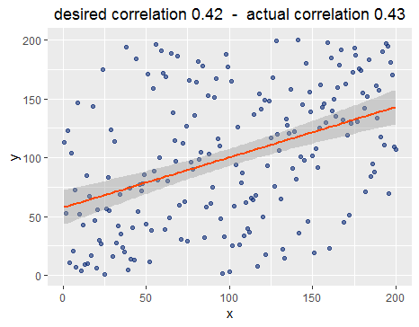

# cmonCorr

Create correlations of a specified size by reshuffling a vector to (not) match another one. Can be used for visualisation and comparison of correlations and exploration of their properties. Based on linear correlations (pearson).

# Installation

```R
devtools::install_github("einGlasRotwein/cmonCorr")

library("cmonCorr")
```

# Examples

## sim_cor_vec

Reshuffles a vector to create a correlation of specified size with another one.

Takes one or two vectors as input. If only one is provided, the second vector is a duplicate of the first one.

```R
vec1 <- 1:100
vec2 <- 51:150

example1 <- sim_cor_vec(vector1 = vec1, vector2 = vec2, r = .2, shuffles = 100)

library(tidyverse)
example1$data %>%
  ggplot(aes(x = x, y = y)) +
  geom_point(colour = "#0c2c76", alpha = .6) +
  geom_smooth(method = "lm", colour = "#ff4600") +
  labs(title = paste("desired correlation", example1$desired_correlation, " - ",
                     "actual correlation", round(example1$actual_correlation, 2))) +
  theme(plot.title = element_text(hjust = .5))
```


```R
vec1 <- 1:200

example2 <- sim_cor_vec(vector1 = vec1, r = .42, shuffles = 1000)
```



## sim_cor_vec

Reshuffles a vector to create a correlation of specified size with another one.

Takes parameters for one or two vectors as input. If only parameters for one are provided, the second vector is created from the parameters of the first one.

**WARNING:** Experimental danger zone, as there will not always be error messages when parameters in arglist are not provided correctly. When in doubt, generate vectors to be correlated outside the function and then use `sim_cor_vec`.

```R
example3 <- sim_cor_param(100, "normal", list(mean = 10, sd = 1), r = .52, shuffles = 1000)
```


```R
example4 <- sim_cor_param(100, "normal", list(mean = 10, sd = 1), r = -.8, shuffles = 100,
                          "unif", list(min = 1, max = 2))
```


## Simpson's Paradox

Uses the sim_cor functions to create a [Simpson's Paradox](https://en.wikipedia.org/wiki/Simpson%27s_paradox). `simpsons_paradox` shifts the subgroups along the x- and y-axis and takes a scaling parameter specifying the degree of the shift. If the initial correlation provided (`r_tot`) has a different sign than the correlation within the subgroups, a "full" Simpson's Paradox is created.

**NOTE:** This is a bit experimental and not every parameter combination will yield a satisfying result. There is always a "price" to pay when creating a Simpson's paradox: Either, the overall correlation between x and y may differ from the desired one as set in `r_tot`. Or x-coordinates of subgroup means will be altered via the `scaling` parameter. Nevertheless, a result where the overall correlation differs from the one within subgroups should always be achievable.

```R
example5 <- simpsons_paradox(r_tot = .8, r_sub = -.7, 
                             means_subgroups = c(-1, 0, 1, 2, 3),
                             nsubgroups = 100, scaling = 3, ymin = 10)
```
Overall correlation:


But within subgroups, it's a different story ...


Note that the correlation between group means is 0.783, while the overall correlation between x and y is only 0.526. Subgroup correlations are: -0.688; -0.684; -0.695; -0.681; -0.687.

Also note that, as specified via `ymin`, the smallest y-coordinate is 10.

---

Credit: Internal functions for input validation adapted from [prmisc](https://github.com/m-Py/prmisc).
